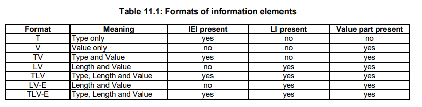
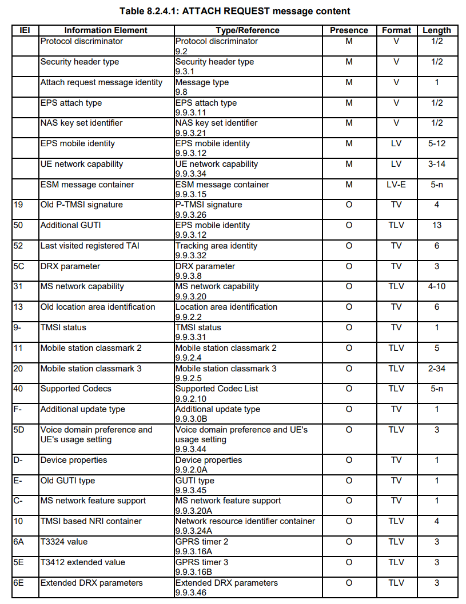

# L3 messages（RRC,NAS）のデータ構造
本書はTS 24.301　TS 24.301を参考にまとめたもの。
TS 24.301には各IEの説明が記載されている。

## L3 messages
L3 messageは命令部（ヘッダーと命令部で構成される）、非命令部で構成される。

## IE
IE(Information Element)は基本的には次の要素で構成される。
- a information element Identifier (IEI)
- a length indicator (LI)
- a value part

標準的なIEのフォーマットは次のようなものである。

この表から、おそらくtypeとIEIは同じ意味だと思われる。

### typeとvalue
IEはtypeを持っている。このtypeによってvalueに使用できる値と情報の基本的な意味が決まる。
valueはハーフオクテット、または1つ以上のオクテットで構成される。

### LI
valueの長さを表す。

### IEI
Information　Element　Identifierの略。Formatにタイプがないものは、これがない。理由は必須IEであり、順番も決まっているのでIEIを記載する意味がないからである。
ハーフオクテット、あるいは1オクテットで構成される。ハーフオクテットのIEIをもつ標準IEは形式がTVであり、そのvalueはハーフオクテットである。

### Presence requirements of IE
- M (Mandatory)
必ず含めなければならない
- C (Conditional)
仕様書に書かれた条件によって変わる
- O (Optional)
任意。受信側はIEがある、ないでエラーを出してはいけない

# Attach request
